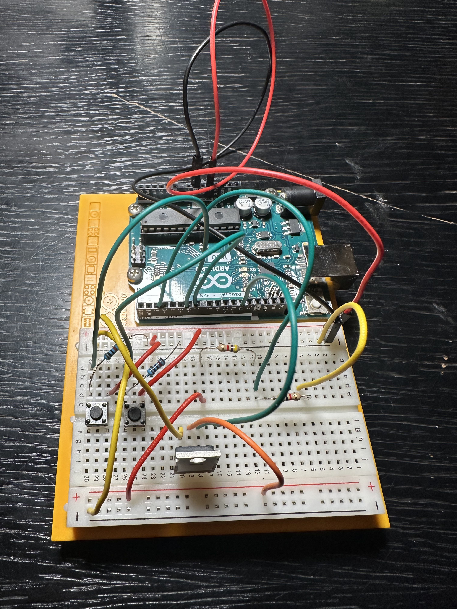
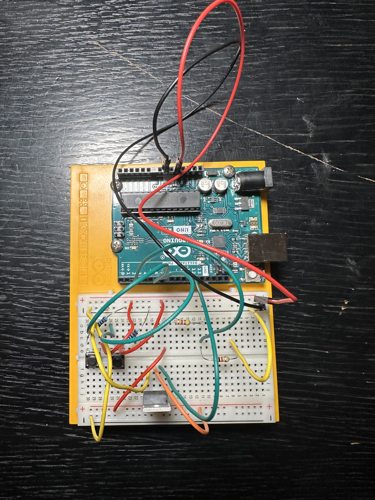
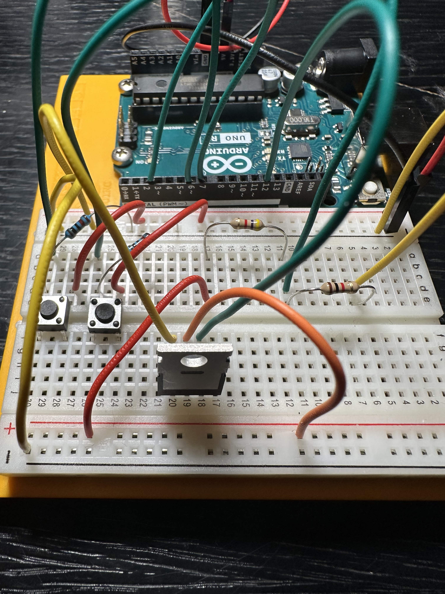
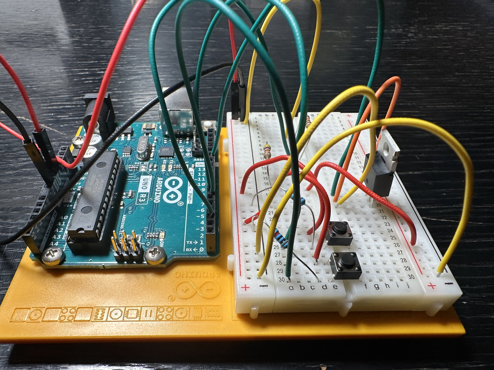
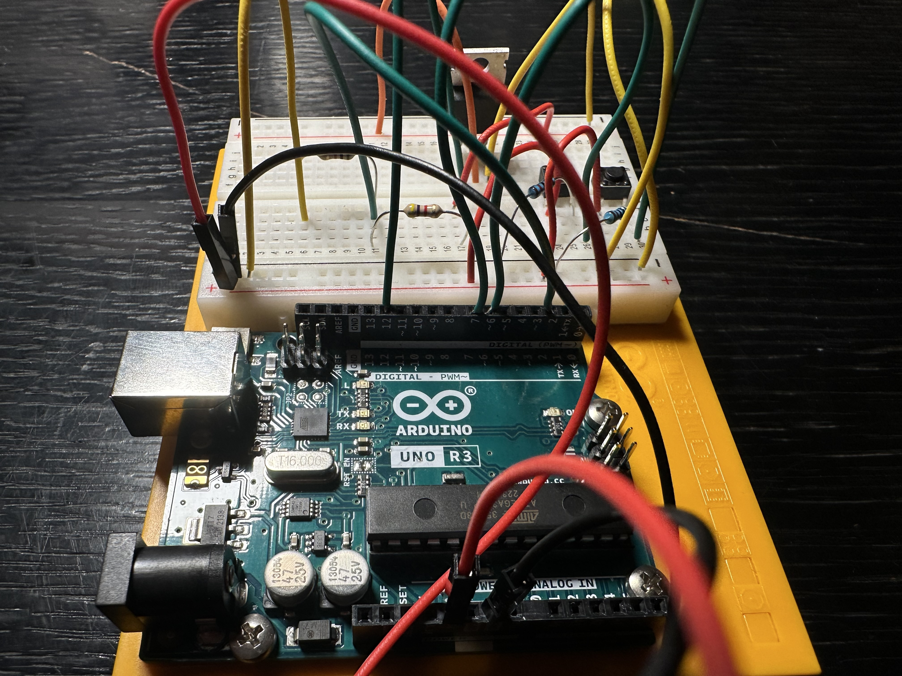
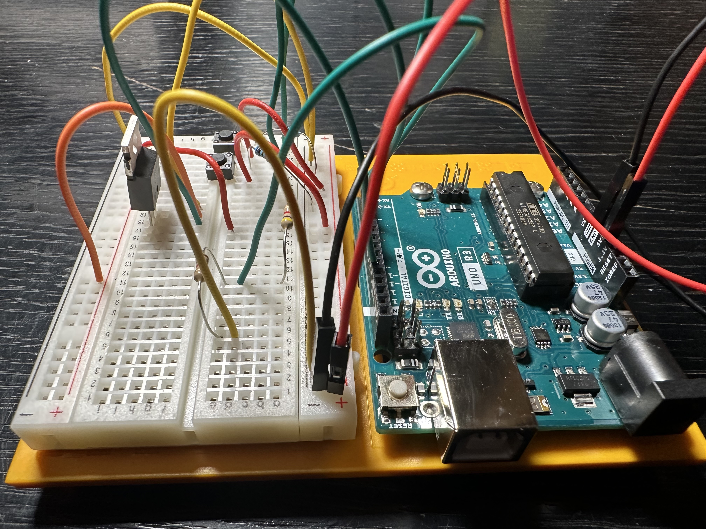
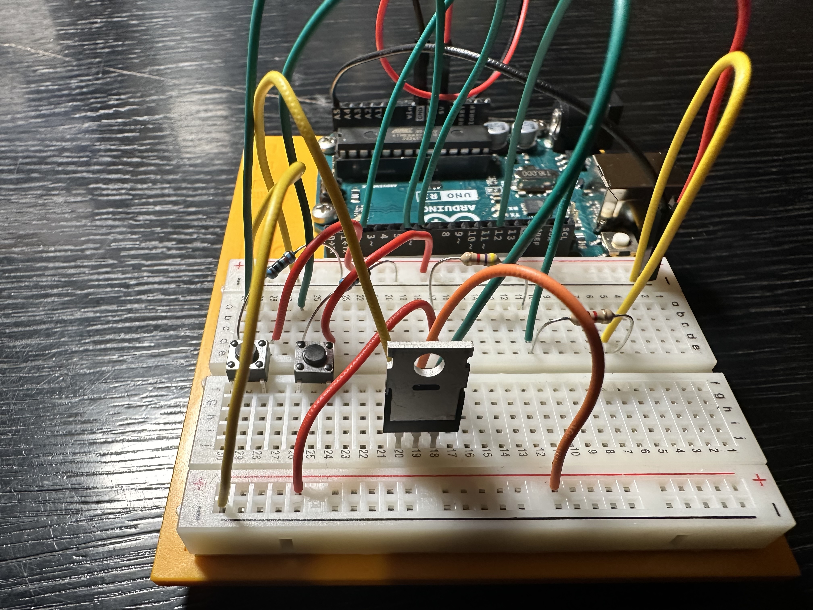
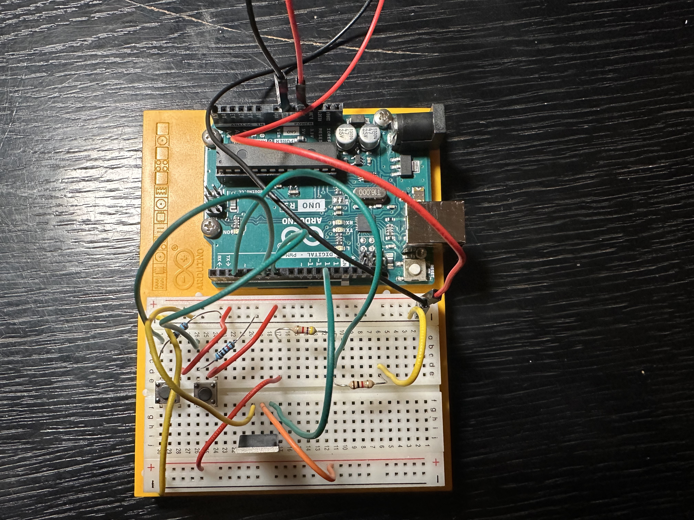
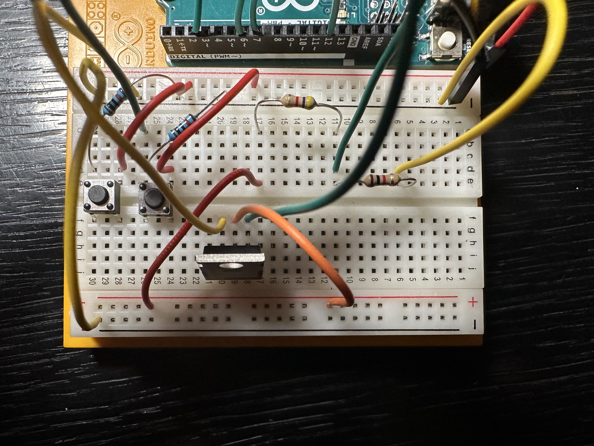

## Circuit
### Input
```
24 V --> 4.7 kOhm --> 1kOhm --> GND
                  |
                  |--> Pin-Digital-2
                  |--> Pin-A2
```
### Output
pending


## Voltage divider

$$ V_{out} = V_{in} * {R2 \over (R1+R2)} $$

$$ V_{out} = 24V * {1k\Omega \over (4.7k\Omega + 1k\Omega)} $$

$$ V_{out} = 24V * {1k\Omega \over 5.7k\Omega} $$

$$ V_{out} = {24V \over 5.7} $$

$$ V_{out} = 4.21V $$


## Decoded signal

#### Door open
- 11E26480
- 4 Bytes == 32 Bit
- 11       E2       64       80
- 0001 0001 1110 0010 0110 0100 1000 0000

#### Ring
- 11E26441
- 4 Bytes == 32 Bit
- 11---------E2--------64--------41--------
- 0001 0001 1110 0010 0110 0100 0100 0001


## Misc
- attachInterrupt()  
Some digital pins support `attachInterrupt` method.  
Syntax: `attachInterrupt(digitalPinToInterrupt(pin), ISR, mode)`  
Modes: `LOW, CHANGE, RISING, FALLING, HIGH`  
ISR: Interrupt Service Routine, special function with limitations, triggered from an event (see modes).  
Use `volatile global variables` to exchange data from ISR and main program.

## Dev Board










## Inspired by / Thanks to
https://github.com/atc1441/TCSintercomArduino
